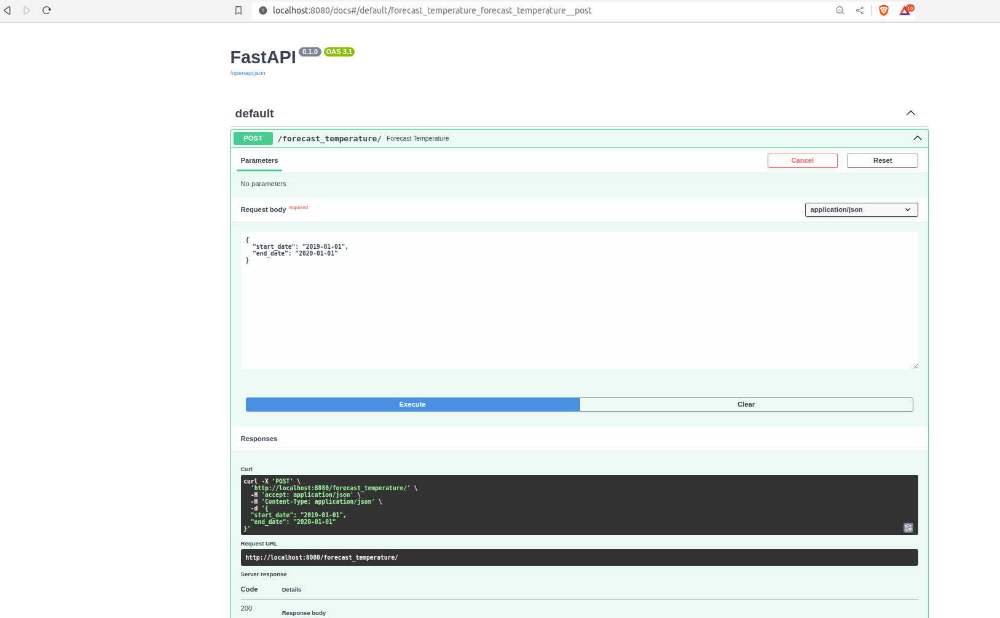
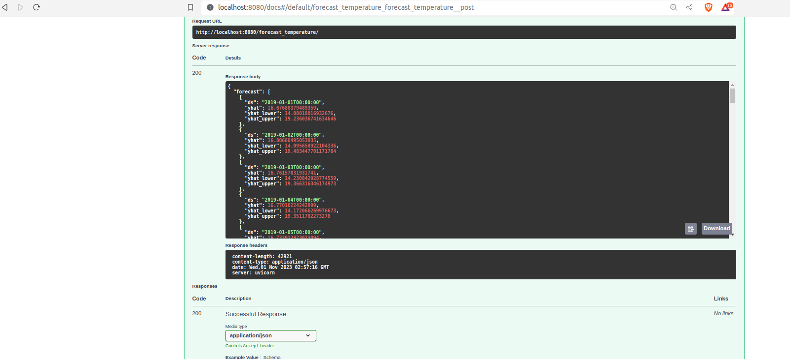
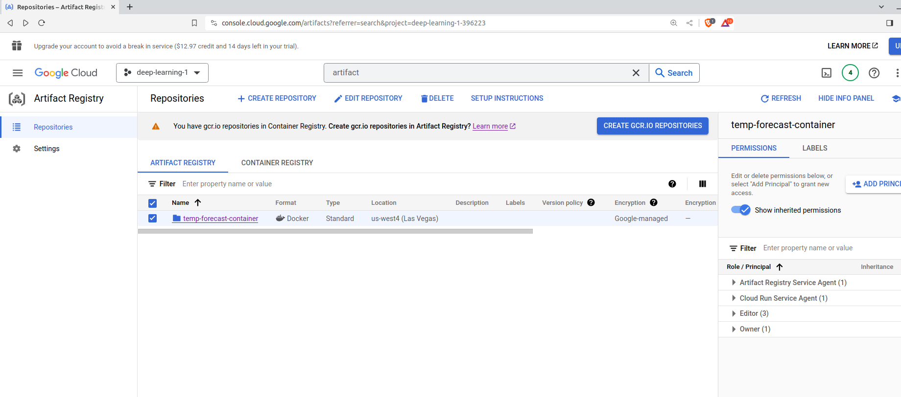
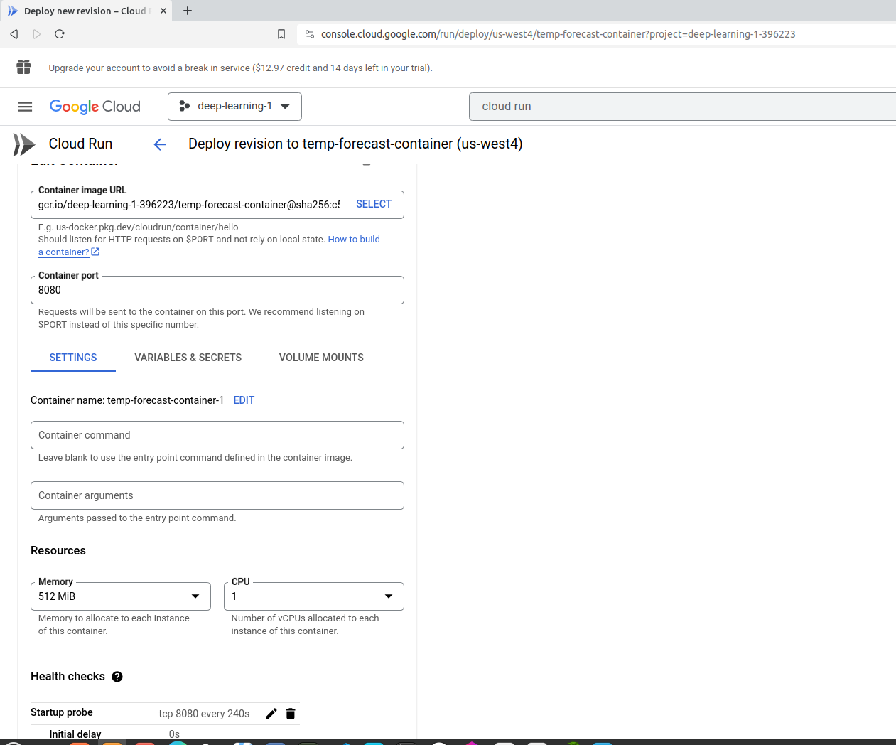
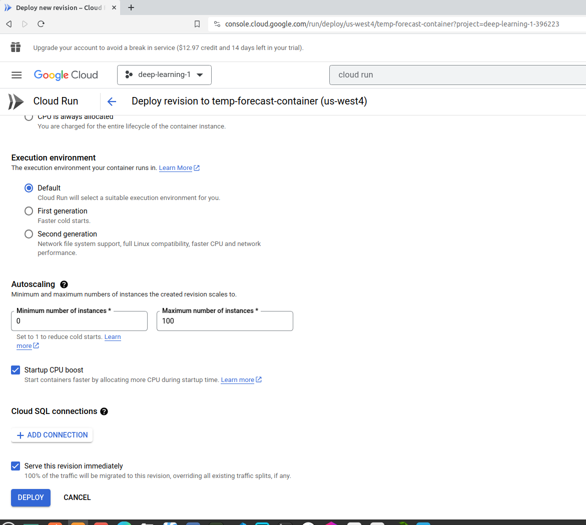
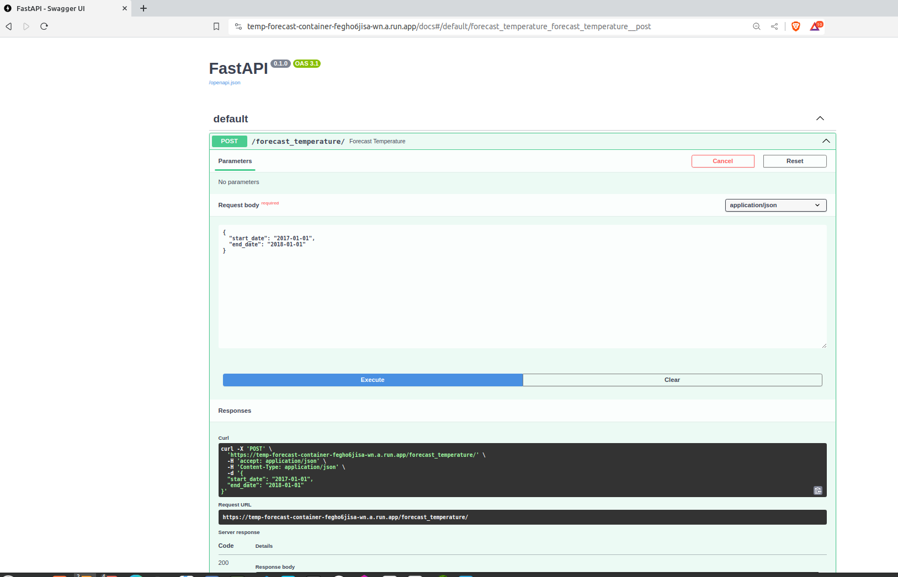
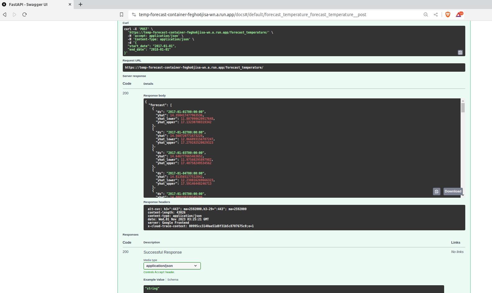

# Temperature forcasting - daily temperature in Delhi, India.

Temperature forecasting is a fundamental aspect of daily life for individuals, businesses, and governments, impacting everything from personal comfort to economic stability and public safety. Accurate predictions can lead to better-informed decisions and greater resilience in the face of changing weather conditions.

Temperature forecasting is important for many reasons, including:
- Protecting lives and property
- Planning activities
- Determining future climate changes
- Helping construction crews make decisions about building
- Helping the tourism industry predict
- Helping utility companies to estimate demand over coming days
- Helping traders within commodity markets
- Helping farmers make decisions about crops

## Methods and tools available for temperature forecasting

Temperature forecasting using time series forecasting involves using historical temperature data to make predictions about future temperatures. Time series forecasting is a statistical method that analyzes past data points in a sequential order to predict future values. In the context of temperature forecasting, it can be applied to predict temperatures for a specific location over a certain period of time, such as daily, weekly, or monthly forecasts.

1. Statistical Models - Exponential smoothing, ARIMA, SARIMA, TBATS, etc.
2. Machine Learning -Linear Regression, XGBoost, Random Forest, etc.
3. Deep Learning - RNN, LSTM

Considering type and amount of data available, we will be focusing on classical/statistical models and frameworks e. g. Prophet for our task at hand.

Prophet is a procedure for forecasting time series data based on an additive model where non-linear trends are fit with yearly, weekly, and daily seasonality, plus holiday effects. It works best with time series that have strong seasonal effects and several seasons of historical data. Prophet is robust to missing data and shifts in the trend, and typically handles outliers well.

## Steps

1. Collect historical temperature data for the location of interest.
2. Preprocess the data by cleaning, filling missing values, and resampling if necessary.
3. Choose an appropriate time series forecasting method.
4. Train the model on the historical data.
5. Validate the model's performance using evaluation metrics.
6. Make forecasts for future temperatures.

## Dataset:
- Available at: https://www.kaggle.com/datasets/sumanthvrao/daily-climate-time-series-data/
- Historical temp data from 2013 to 2017`
- Location: Delhi, India

## EDA, Data preprocessing, Visualizations and Model training experimentation

- Refer to Jupyter notebooks:
    - `temp-forecasting-model.ipynb`
    - `use-model-for-forecast.ipynb`

# How to run this project?

## Prerequisites
- `anaconda` or `miniconda` with conda package manager
- `docker` and `docker-compose`
- `Terraform` and `Google Cloud SDK`
- Access to Google Cloud Platform (Free trial account may be sufficient)
- Dataset downloaded

## Steps

### A) Setup local developement environment

Note: This project was entirely developed in cloud mimicking local system using Google Cloud Platform (GCP): VM instance running Ubuntu

        Distributor ID: Ubuntu
        Description: Ubuntu 22.04.2 LTS
        Release: 22.04
        Codename: jammy

1. Create a new conda environment
```
conda create -n time-series python=3.12
conda activate time-series
```
2. Clone this repository
```
git clone https://github.com/ranga4all1/temp-forecasting.git
```
3. Install dependencies
```
cd temp-forecasting
pip install -r requirements.txt
```

### B) Data
1. Download data (This step is NOT needed if you cloned entire repo)

Available at: https://www.kaggle.com/datasets/sumanthvrao/daily-climate-time-series-data/

### C) Model training
1. Train model using below script
```
cd deployment
python train.py
```
This should save model with name - `prophet_base_model.pkl`

2. Run fastAPI service using below script
```
uvicorn predict-fastapi:app --reload --port 8080
```
3. Test FastAPI service
- Manual Test using swagger UI: http://127.0.0.1:8080/docs

    Click on `POST` --> `Try it out`

    Use this in response body:

    {
    "start_date": "2017-01-01",

    "end_date": "2018-01-01"
    }

    Click `Execute`

    Server response: `Code 200`
    Response body:

    ```
    {
    "forecast": [
    {
        "ds": "2017-01-01T00:00:00",
        "yhat": 14.350417477963536,
        "yhat_lower": 11.818154982519141,
        "yhat_upper": 16.866275645970042
    },
    {
        "ds": "2017-01-02T00:00:00",
        "yhat": 14.560720771673228,
        "yhat_lower": 12.046326732340306,
        "yhat_upper": 17.300754751043186
    },
    {
        "ds": "2017-01-03T00:00:00",
        "yhat": 14.646777665463654,
        "yhat_lower": 12.06254970031039,
        "yhat_upper": 17.159654029707003
    },
        ...
        ...

        {
        "ds": "2018-01-01T00:00:00",
        "yhat": 15.582847449273126,
        "yhat_lower": 13.091240296709314,
        "yhat_upper": 18.24466364563218
        }
    ]
    }
    ```

- Automated testing using:
    ```
    python test.py
    ```
    Response should lokk like this:
    ```
    API call was successful
    {'forecast': [{'ds': '2017-01-01T00:00:00', 'yhat': 14.350417477963536, 'yhat_lower': 11.788658429567555, 'yhat_upper': 16.991241598055787}, {'ds': '2017-01-02T00:00:00', 'yhat': 14.560720771673228, 'yhat_lower': 11.755473296591438, 'yhat_upper': 17.21869201339477},.....
    ```

### D) Deployment

Outline:

1. Create a separate conda environment and deploy the FastAPI web service.
2. Dockerize the conda environment.
3. Setup Google Cloud Platform (GCP)
3. Create infrastructure on Google Cloud Platform (GCP) using Terraform
4. Push docker container image to Google Artifact/Container Registry (GCR)
5. Deploy uploaded container to Google Cloud Run
6. Test the deployed web service using the API call

#### Step 1: Deploy FastAPI Web Service in a Separate Conda Environment locally
```
conda deactivate
conda create -n temp-forecast python=3.12
conda activate temp-forecast
pip install -r requirements.txt
```
Run and Test using:
```
python predict-fastapi.py
python test.py
```

#### Step 2: Dockerize the Conda Environment

1. Export conda environment Configuration
```
conda env export > environment.yml
```
2. create a Docker container for your FastAPI service using a Dockerfile
```
docker build -t predict-fastapi .
```
3. Check docker image created using
```
docker images
```
3. Run the container using
```
docker run -d -p 8080:8080 predict-fastapi
docker ps
```
4. Test using:
```
python test.py
```
OR by using swagger UI: http://localhost:8080/docs




#### Step 3: Setup Google Cloud Platform (GCP)

1. Create a Google Cloud Platform (GCP) project
2. Enable the Artifact Registry API for your project in the GCP console. Make sure to select the project you are using and click the "Enable" button.
3. Create a service account key to enable Terraform to access your GCP account. When creating the key, use the following settings:

    - Select the project you created in the previous step.
        - Click "Create Service Account".
        - Give it any name you like and click "Create".
        - For the Role, choose "Project -> Editor", then click "Continue".
        - Skip granting additional users access, and click "Done".
        - After you create your service account, download your service account key.

    - Select your service account from the list.
        - Select the "Keys" tab.
        - In the drop down menu, select "Create new key".
        - Leave the "Key Type" as JSON.
        - Click "Create" to create the key and save the key file to your system in `terrform-gcp` folder.

4. Enable below additional APIs:
    - Cloud Run API
    - Cloud Resource Manager API

#### Step 4: Create infrastructure on Google Cloud Platform (GCP) using Terraform
1. Update `main.tf` file in `terraform-gcp` folder with below parameters
- credentials = file("YOUR-SERVICE-KEY")
- project     = "YOUR-PROJECT-ID"
- region      = "YOUR-REGION"
- location    = "ROUR-REGION"

2. Run below scripts
```
cd terraform-gcp
terraform init
terraform fmt
terraform validate
terraform apply
```
Note: Type 'yes' on plan apply prompt

2. Verify
```
terraform show
```
3. Check on GCP console that Artifact registry is created


#### Step 5: Upload a Docker image to Google Container Registry
1. Authenticate with Google Cloud:
Use service account created earlier to authenticate with Google Cloud:
```
gcloud auth list
gcloud auth activate-service-account <YOUR_SERVICE_ACCOUNT> --key-file=<YOUR-KEY-FILE>
```
2. Configure docker to use gcloud auth
```
gcloud auth configure-docker
```
3. Tag docker image with repository URL and upload
```
docker tag predict-fastapi gcr.io/<YOUR_PROJECT_ID>/temp-forecast-container:gcp-temp-predict
docker push gcr.io/<YOUR_PROJECT_ID>/temp-forecast-container:gcp-temp-predict
gcloud container images list --repository=gcr.io/<YOUR_PROJECT_ID>
```

#### Step 6: Deploy uploaded container to Google Cloud Run

1. On GCP console, create Cloud RUN service using below parameters

- Container image: Use uploaded docker image from artifact/container registry
- Service Name: `temp-forecast-container`
- container Port: `8080` (default is 8080)
- Region: `YOUR-REGION`
- Authentication: Allow unauthenticated invocations




#### Step 7: Test the deployed web service using the API call

1. Manual test - fastAPI swagger UI: https://temp-forecast-container-fegho6jisa-wn.a.run.app/docs
2. Automated test - Update `test-cloud.py` with your Cloud Run URL and then run below script
```
cd ..
python test-cloud.py
```
Note: This service is currently deployed to Google CLOUD RUN and is available at https://temp-forecast-container-fegho6jisa-wn.a.run.app/docs for testing. This is expected to be teared down in 2 days. In that case, refer to screenshots below.




---------------------------------
---------------------------------


## Appendix 1: Install Terraform
Go to the Terraform website and download the appropriate binary for your operating system: https://www.terraform.io/downloads.html
```
wget https://releases.hashicorp.com/terraform/1.6.2/terraform_1.6.2_linux_386.zip
unzip terraform.zip
sudo mv terraform /usr/local/bin/
terraform --version
```
## Appendix 2: Install Google Cloud SDK
Download and install Google Cloud SDK from here: https://cloud.google.com/sdk/docs/install